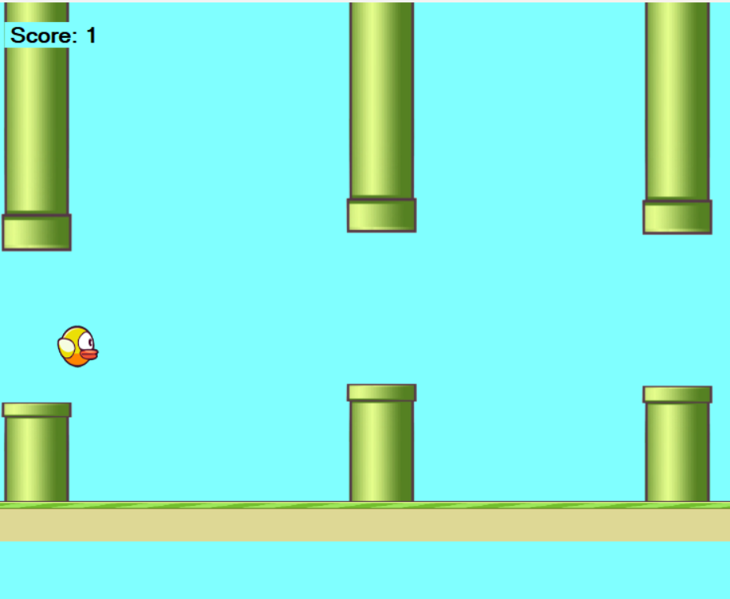

# Flappy Bird Oyunu (C# Windows Forms)

Bu proje, popüler mobil oyun Flappy Bird'ün C# programlama dili ve Windows Forms kütüphanesi kullanýlarak geliþtirilmiþ bir masaüstü versiyonudur. Amaç, kuþu borulara çarpmadan mümkün olan en yüksek skoru elde etmektir.



---

## Özellikler

* **Sonsuz Oyun Döngüsü:** Borular, siz oyunu kaybedene kadar sonsuz bir þekilde üretilir.
* **Dinamik Boru Konumlarý:** Her boru çiftinin yüksekliði rastgele olarak belirlenir.
* **Skor Takibi:** Baþarýyla geçilen her boru çifti için skor artar.
* **Artan Zorluk:** Skor arttýkça oyunun hýzý da artarak daha zorlu bir deneyim sunar.
* **Çarpýþma Tespiti:** Kuþun borulara, zemine veya tavana çarpmasý hassas bir þekilde kontrol edilir.
* **Yeniden Baþlatma:** Oyun bittiðinde `Enter` tuþuna basarak hýzlýca yeniden baþlayabilirsiniz.

---

## Nasýl Oynanýr?

1.  **Zýplama:** Kuþu havada tutmak ve zýplatmak için `Boþluk (Space)` tuþuna basýn.
2.  **Amaç:** Kuþu, alt ve üst borularýn arasýndan çarpmadan geçirin.
3.  **Yeniden Baþlatma:** Oyun bittiðinde, yeni bir oyuna baþlamak için `Enter` tuþuna basýn.

---

## Kullanýlan Teknolojiler

* **Programlama Dili:** C#
* **Framework:** .NET Framework
* **Arayüz:** Windows Forms (WinForms)
* **IDE:** Microsoft Visual Studio 2022

---

## Kurulum ve Çalýþtýrma

Projeyi yerel makinenizde çalýþtýrmak için aþaðýdaki adýmlarý izleyebilirsiniz:

1.  Bu depoyu klonlayýn:
    ```bash
    git clone 'https://github.com/Nananisnana/flappybird.git'
    ```
2.  Proje klasörüne gidin ve `flappybird.sln` dosyasýný Visual Studio 2022 veya üzeri bir versiyon ile açýn.
3.  Projeyi baþlatmak için `F5` tuþuna basýn veya Visual Studio'daki "Start" butonuna týklayýn.

---

## Gelecekteki Geliþtirmeler

* [ ] Zýplama, skor ve çarpma anlarý için ses efektleri eklemek.
* [ ] Oyun baþlangýcýnda bir ana menü oluþturmak.
* [ ] En yüksek skoru bir dosyaya kaydedip göstermek.
* [ ] Farklý kuþ görünümleri veya tema seçenekleri sunmak.

---

## Geliþtirici

* **Nisa Apaydýn** - *Proje Sahibi*
* GitHub: `https://github.com/Nananisnana`

---

## Lisans

Bu proje MIT Lisansý ile lisanslanmýþtýr. Detaylar için `LICENSE` dosyasýna göz atýn.